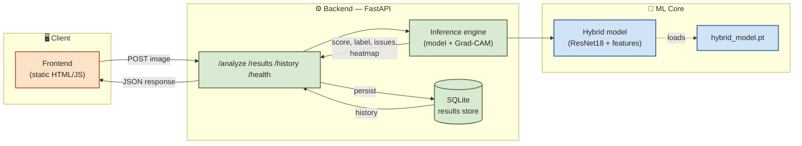
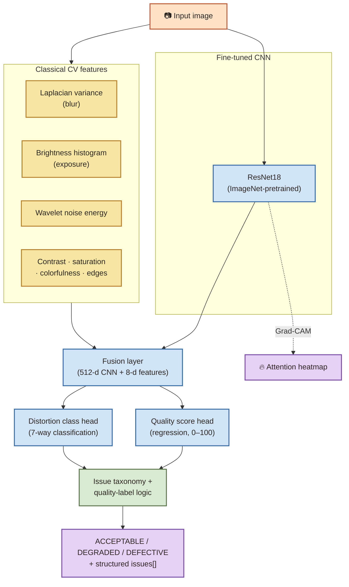

# 🔍 Image Quality & Defect Detection

<p align="center">
  
  
  
  
  
</p>

<p align="center"><b>Upload an image. Get back a verdict, a score, a reason, and a picture of where the model looked.</b></p>

<p align="center">
  <code>ACCEPTABLE</code> · <code>DEGRADED</code> · <code>DEFECTIVE</code> — plus a structured issue list
  (<code>blur</code>, <code>underexposure</code>, <code>overexposure</code>, <code>noise</code>,
  <code>corruption</code>, <code>defect</code>), each with severity and confidence, backed by a
  fine-tuned CNN fused with interpretable classical-CV features, and a Grad-CAM heatmap explaining
  the decision. No external AI APIs — everything runs locally.
</p>

---

### Contents

[Quick start](#-quick-start) · [At a glance](#-at-a-glance) · [System architecture](#-system-architecture) · [Model pipeline](#-model-pipeline) · [Requirements coverage](#-requirements-coverage) · [Approach](#approach) · [Issue taxonomy](#issue-taxonomy) · [Project layout](#project-layout) · [Running locally](#running-locally-without-docker) · [Database](#database-setup) · [Environment variables](#environment-variables) · [API examples](#api-examples) · [Docker](#running-with-docker) · [Cloud deployment](#cloud-deployment-backend-on-render-frontend-on-vercel) · [Evaluation](#evaluation)

---

## ⚡ Quick start

The trained model checkpoint is committed to this repo (`models/hybrid_model.pt`) — no
training or dataset download required to try it. Clone and run:

```bash
git clone https://github.com/JMadhan1/image_quality_assessment.git
cd image_quality_assessment
docker compose up --build
```

Then open **http://localhost:8080**, drop an image in, and see the result. Backend API is at
http://localhost:8000 (`/docs` for interactive Swagger docs). That's the whole setup — nothing
else to install or configure. (Want to retrain, run without Docker, or see the API directly?
Jump to [Running locally](#running-locally-without-docker) or [API examples](#api-examples).)

---

## 📊 At a glance

| | |
|---|---|
| 🎯 Test accuracy | **84.4%** (7-class distortion classification) |
| 📐 Weighted F1 | **0.849** |
| 📉 Quality-score error | MAE **4.01**, RMSE **6.67** (0–100 scale) |
| 🌍 Generalization | **93%** of unseen-domain, undegraded images correctly rated ACCEPTABLE |
| 🗂️ Dataset | 38,000 synthetically-degraded images — 6 distortion types × 5 severities |
| 🧠 Model | Fine-tuned ResNet18 + 8 engineered CV features, fused |
| 🚀 Deployment | Docker Compose (verified end-to-end) · backend also live on Render — [status](#cloud-deployment-backend-on-render-frontend-on-vercel) |

Full reasoning behind every number above — including three alternative architectures tried and
*why they didn't ship* — is in **[EVALUATION.md](EVALUATION.md)**.

---

## 🏗 System architecture



Deployed as two independent Docker containers (`docker-compose.yml`) — frontend on nginx,
backend on uvicorn — communicating over HTTP, each with its own health surface.

---

## 🧪 Model pipeline



The CNN's `brightness` class is direction-agnostic on its own — it only says exposure is off,
not which way. The engineered `brightness_mean` feature resolves the direction. This is the
clearest concrete example of why the hybrid fusion is more informative than either signal alone.

---

## ✅ Requirements coverage

Maps every numbered requirement in the assessment brief to where it's satisfied, so nothing
needs to be taken on faith:

| Brief section | Satisfied by |
|---|---|
| 1. Problem statement (accept image, ACCEPTABLE/DEGRADED/DEFECTIVE) | `quality_decision.py: quality_label()` |
| 2. Six detection capabilities | [Issue taxonomy](#issue-taxonomy) below |
| 3. AI/CV requirement (hybrid) | `model.py` (CNN) + `data_pipeline/features.py` (engineered) + EVALUATION.md §Model selection |
| 4. Image analysis features | `data_pipeline/features.py` — 8 features: sharpness, brightness, contrast, noise, saturation, colorfulness, edge density |
| 5. Backend (REST, validation, JSON, SQLite, history, errors) | `main.py`, `db.py` |
| 6. Frontend (upload, score, issues, severity/confidence, history, states, responsive) | `frontend/index.html` |
| 7. Response shape | `inference.py: analyze_image()` output |
| 8. Dataset + generalization evidence | `data_pipeline/generate_dataset.py`, `generalization_check.py`, EVALUATION.md §Generalization |
| 9. Evaluation (metrics, failure cases, limitations) | `evaluate.py`, `EVALUATION.md` |
| 10. Explainability | `inference.py` Grad-CAM + `engineered_features` in every response |
| 11. Deployment (Docker, env vars, health check, model-loading docs) | `docker-compose.yml`, [Environment variables](#environment-variables), `/health`, [Model loading](#model-loading--inference-at-deployment) |
| 12. Submission deliverables | this README, `EVALUATION.md`, `samples/`, `docker-compose.yml`, [Cloud deployment](#cloud-deployment-backend-on-render-frontend-on-vercel) |
| 13. Bonus: quality heatmaps/localization | Grad-CAM (also satisfies #10) |

---

## Approach

**Hybrid model** — engineered CV features (Laplacian-variance blur, exposure histogram stats,
wavelet-based noise energy, contrast, saturation, colorfulness, edge density) fused with a
fine-tuned ResNet18 backbone (ImageNet-pretrained, PyTorch). The CNN classifies distortion type
and regresses a quality score; the engineered features stay directly interpretable and are
reported alongside the CNN's prediction, and are also used to disambiguate cases the CNN's
classes leave coarse (see the taxonomy below).

**Fine-tuning over from-scratch** — a pretrained backbone converges to useful accuracy in hours
on a single 6GB-VRAM GPU; training a CNN from scratch would not, given the assessment's 48-hour
window.

**Backbone: ResNet18, chosen over three follow-up attempts to beat it** — ResNet34 and
ConvNeXt-Tiny were both tried in pursuit of higher accuracy; ResNet18 won on the metric that
mattered (test accuracy), while the alternatives won on other axes (better score-regression MAE)
or didn't finish (environment instability). Full numbers and reasoning: [Model
selection](EVALUATION.md#model-selection-what-was-tried-and-why-the-baseline-won) in
EVALUATION.md. `train.py` still supports all three via `--backbone`.

**Dataset** — synthetically generated: 2,000 diverse clean photos from the Oxford-IIIT Pet
dataset (auto-downloaded via torchvision), degraded programmatically across 6 distortion types
(blur, Gaussian noise, salt-and-pepper noise, brightness/exposure shift, JPEG compression, block
corruption) at 5 severity levels each — giving labeled ground truth (type + severity + derived
quality score) for free, 38,000 images total. Splits are by source image so no photo's variants
leak across train/val/test (a model that memorized one variant of a photo could otherwise get
credit for "generalizing" to another variant of the same photo).

### Issue taxonomy

The CNN's 7 distortion classes and the engineered features' raw flags are both mapped into a
canonical issue-type taxonomy that matches the assessment's required categories exactly
(`backend/quality_decision.py`):

| Required capability | Canonical `issue.type` | Triggered by |
|---|---|---|
| 🌫️ Blur / insufficient sharpness | `blur` | CNN `blur` class, or `laplacian_var` < 50 |
| 🔦 Underexposure | `underexposure` | CNN `brightness` class (direction resolved via `brightness_mean` < 127), or `brightness_mean` < 60 |
| ☀️ Overexposure | `overexposure` | CNN `brightness` class (direction resolved via `brightness_mean` ≥ 127), or `brightness_mean` > 200 |
| 📻 Image noise | `noise` | CNN `gaussian_noise`/`salt_pepper` classes, or `noise_energy` > 8 |
| 🧩 Corruption / severe degradation | `corruption` | CNN `jpeg`/`block_corrupt` classes |
| ⚠️ Potential visual defect | `defect` | CNN `block_corrupt` class specifically (localized, high-frequency artifacts most resembling a physical/sensor defect) — always forces `quality_label = DEFECTIVE` regardless of score |

`low_contrast` is reported as an additional bonus signal (contrast < 20), justified per the
brief's "additional quality issues may be identified if technically justified."

### Quality label thresholds

```
if "defect" in issue_types:      DEFECTIVE            (regardless of score)
elif quality_score >= 75:        ACCEPTABLE
elif quality_score >= 40:        DEGRADED
else:                             DEFECTIVE
```

Thresholds align with the synthetic label scale used to build the dataset
(`quality_score = 100 - (severity-1)*20`, so severity 1 ≈ 100, severity 5 ≈ 20): severity-1
(near-clean) lands solidly in ACCEPTABLE, severities 2–3 land in DEGRADED, severities 4–5 land
in DEFECTIVE.

---

## Project layout

```
backend/
  data_pipeline/
    generate_dataset.py     # builds the labeled synthetic dataset
    features.py              # classical CV feature extraction
  model.py                   # hybrid CNN + feature-fusion architecture
  dataset.py                  # torch Dataset + transforms
  train.py                     # two-stage fine-tuning (frozen -> full)
  evaluate.py                   # precision/recall/F1, confusion matrix, MAE/RMSE
  generalization_check.py        # unseen-domain generalization evidence
  quality_decision.py             # canonical issue taxonomy + ACCEPTABLE/DEGRADED/DEFECTIVE label
  inference.py                     # single-image inference + Grad-CAM
  main.py                           # FastAPI app
  db.py                              # SQLite result storage
frontend/
  index.html                         # upload UI, score/issues display, history
models/
  hybrid_model.pt                     # trained checkpoint (generated)
  eval_report.json                     # test-set evaluation (generated)
  generalization_report.json            # unseen-domain check (generated)
samples/                                 # sample images per quality condition, see samples/README.md
data/                                     # generated dataset (not checked in)
docker-compose.yml
render.yaml                                # Render Blueprint (backend cloud deploy)
EVALUATION.md                                # full evaluation write-up
```

---

## Running locally (without Docker)

```bash
python -m venv venv
venv/Scripts/activate        # or source venv/bin/activate on Linux/Mac
pip install -r requirements.txt

# 1. generate the dataset (downloads Oxford-IIIT Pet on first run)
cd backend/data_pipeline && python generate_dataset.py --out ../../data

# 2. train (--backbone resnet18 reproduces the shipped model exactly;
#    train.py also supports resnet34 and convnext_tiny -- see
#    "Model selection" in EVALUATION.md for why resnet18 is what shipped)
cd .. && python train.py --data_root ../data --out ../models/hybrid_model.pt --backbone resnet18

# 3. evaluate
python evaluate.py --data_root ../data --checkpoint ../models/hybrid_model.pt

# 4. (optional) generalization check on an unseen-domain dataset
python generalization_check.py --data_root ../data --checkpoint ../models/hybrid_model.pt

# 5. serve
uvicorn main:app --reload --port 8000
```

Open `frontend/index.html` in a browser (served statically, e.g. `python -m http.server` from
the `frontend/` folder) once the backend is running on `localhost:8000` — the frontend
auto-detects and uses `localhost:8000` whenever it's served from localhost (see the `API_BASE`
logic in `frontend/index.html`; a static HTML page has no build-time env-var injection, so this
is a plain hostname check rather than a config file).

---

## Database setup

No manual setup needed. `db.py` uses SQLite; the table is created automatically on backend
startup (`init_db()` in `main.py`'s startup event) at `backend/results.db` by default, or at
`$DB_DIR/results.db` if the `DB_DIR` environment variable is set (this is how Docker Compose
points it at the mounted volume — see below).

---

## Environment variables

| Variable | Default | Purpose |
|---|---|---|
| `MODEL_CHECKPOINT_PATH` | `../models/hybrid_model.pt` (relative to `backend/`) | Path to the trained model checkpoint to load |
| `DB_DIR` | `backend/` | Directory the SQLite file is created in |
| `CORS_ORIGINS` | `*` | Comma-separated allowed origins for the frontend |
| `MAX_UPLOAD_BYTES` | `20971520` (20MB) | Rejects larger uploads with a 400 |

---

## API examples

Interactive docs (Swagger UI) are auto-generated by FastAPI at `http://localhost:8000/docs` once
the backend is running.

**Health check:**
```bash
curl http://localhost:8000/health
# {"status":"ok","checkpoint_exists":true,"checkpoint_path":"..."}
```

**Analyze an image:**
```bash
curl -X POST http://localhost:8000/analyze -F "file=@samples/02_blur.jpg"
```
```json
{
  "quality_score": 30.2,
  "quality_label": "DEFECTIVE",
  "issues": [
    {"type": "blur", "severity": "high", "confidence": 0.911, "source": "cnn+engineered_features"}
  ],
  "predicted_distortion": "blur",
  "distortion_confidence": 0.911,
  "class_probabilities": {"none": 0.01, "blur": 0.911, "...": "..."},
  "engineered_features": {
    "laplacian_var": 6.2, "brightness_mean": 118.4, "brightness_std": 52.1,
    "contrast": 52.1, "saturation_mean": 96.3, "noise_energy": 1.8,
    "edge_density": 0.02, "colorfulness": 41.7
  },
  "gradcam_heatmap_base64": "<base64 PNG>",
  "id": 1
}
```

**Retrieve a past result:**
```bash
curl http://localhost:8000/results/1
```

**History:**
```bash
curl http://localhost:8000/history?limit=20
```

> Invalid uploads are handled gracefully — a non-image content-type, an empty file, and
> undecodable/corrupted bytes all return `400` with a descriptive `detail` message rather than a
> server error (verified with each case; see "Handling invalid uploads" in EVALUATION.md).

---

## Running with Docker

```bash
docker compose up --build
```

Frontend: http://localhost:8080 — Backend: http://localhost:8000

Note: the model must be trained (`models/hybrid_model.pt` present) before building the backend
image, since it's copied in at build time. The SQLite database is stored in a named Docker
volume mounted at `/app/db` inside the container (`DB_DIR=/app/db`), so results persist across
container restarts.

---

## Cloud deployment (backend on Render, frontend on Vercel)

Cloud deployment is optional per the assessment brief; local Docker Compose is already
sufficient and fully verified (see above). It was also attempted for real, with an honest
result:

> **Current status:** backend deployed at `https://image-quality-backend-mcck.onrender.com`
> (Render free tier). `/health` responds correctly. **`/analyze` currently returns 502** — this
> is almost certainly Render's free-tier 512MB RAM limit being exceeded once PyTorch,
> torchvision, OpenCV, and the loaded model are all in memory together (health checks don't load
> the model; the crash happens on the first real inference request, when memory spikes).
> Confirmed reproducible: `/health` succeeds, then fails immediately after the first `/analyze`
> attempt and doesn't recover on its own. Fixing this for real needs either a paid Render plan
> (Standard tier, 2GB RAM) or further work trimming the memory footprint — noted here rather
> than glossed over, since the local Docker deployment is the one that's actually proven to work.

The frontend (`frontend/index.html`) already auto-detects: it uses `localhost:8000` when served
from localhost, and the Render URL above otherwise — no manual editing needed if deployed as-is.

**Why the backend isn't on Vercel too:** a serverless platform like Vercel is a poor fit for
this backend specifically — the PyTorch/OpenCV dependencies alone exceed typical serverless
function size limits, and a 45MB model reloading on every cold start would be slow even if it
fit.

**Backend on Render (steps, for redeploying or on a different account):**
1. Push this repo to GitHub (already done — you're reading it from there).
2. On [render.com](https://render.com): New → Blueprint → connect this repo. `render.yaml` at the repo root is auto-detected and configures the service (Docker runtime, `backend/Dockerfile`, `/health` as the health check path).
3. Render injects a `PORT` environment variable at runtime; `backend/Dockerfile`'s `CMD` reads it (`--port ${PORT:-8000}`) — verified locally by simulating `PORT=10000` and confirming uvicorn bound to it, so no manual port configuration is needed.
4. **Free-tier caveats:** no persistent disk (SQLite history resets on every redeploy/restart) and, as found above, 512MB RAM is tight for this stack. A paid "Standard" plan (2GB RAM) resolves both.

**Frontend on Vercel:**
1. Deploy the `frontend/` folder as a static site (no build step needed).
2. Nothing to edit — `API_BASE` auto-detects and will use the Render URL automatically once served from a non-localhost domain.
3. Set `CORS_ORIGINS` on the Render backend to your Vercel domain (via Render's dashboard env vars) instead of leaving it at `*`, once you know the deployed frontend URL.

---

## Model loading & inference at deployment

The checkpoint (`models/hybrid_model.pt`, ~45MB) is loaded once, lazily, on the first
`/analyze` request (`inference.py: load_model()`), not at process startup — this keeps
`/health` fast and avoids a slow cold start blocking the whole server. The model and its
Grad-CAM wrapper are cached as module-level singletons afterward, so subsequent requests reuse
the loaded weights. Device selection is automatic (`cuda` if available, else `cpu` fallback) —
the same checkpoint runs on either; GPU is only needed for training, not for serving.

---

## Evaluation

See **[EVALUATION.md](EVALUATION.md)** for full precision/recall/F1 per distortion type,
confusion matrix, quality-score MAE/RMSE, and failure-case analysis on the held-out synthetic
test split, plus `models/generalization_report.json` for the unseen-domain (Oxford Flowers102)
generalization check.

---

### Note

I did try deploying the backend live (Render) so there'd be a real hosted URL, not just local
Docker. It's up, but crashes on the first real request — Render's free tier only gives 512MB
RAM, and PyTorch + the model together need more than that, so it runs out of memory. A paid
plan would fix it; wasn't worth spending on for this. Everything above is proven working through
**local Docker** instead, which anyone can run themselves with the one command in
[Quick start](#-quick-start) — that's the version to actually judge this on.
